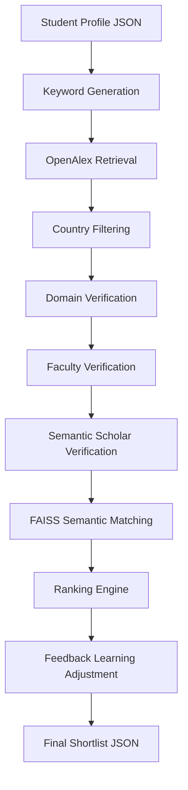

# PhD Shortlist Builder

> Ambitio AI Engineer Take-Home Assignment — ranked PhD supervisor recommendations from a student profile, with contamination reduction at every stage.

---

## Overview

Given a student profile JSON, the pipeline retrieves, verifies, and ranks PhD supervisors from OpenAlex and Semantic Scholar, producing a shortlist of 50–200 actionable recommendations. The focus is on **data quality over coverage**: wrong-person matches, junior researchers, and off-domain results are filtered before any candidate reaches the ranking step.

---

## Key Features

- **Single-command execution** — reproducible end-to-end from one command
- **Hard country constraint** — 100% of output within student's target countries
- **Faculty gate** — PhD students, postdocs, and industry researchers rejected
- **Domain verification** — discipline mismatch penalty prevents off-topic leakage
- **Semantic Scholar cross-check** — name + institution + topic validation
- **FAISS semantic matching** — `all-MiniLM-L6-v2` embeddings for interest alignment
- **Feedback learning** — outcomes CSV adjusts future rankings
- **Graceful degradation** — Semantic Scholar rate limits handled without crashing

---

## System Architecture



---

## Pipeline Description

| Stage | What it does |
|---|---|
| **Keyword Generation** | Gemini normalizes raw research interests into specific subfield terms; rule-based fallback when Gemini is unavailable |
| **OpenAlex Retrieval** | Works-based author extraction across multiple keyword queries; capped at 400 raw candidates |
| **Country Filtering** | Hard filter against target country ISO codes; researchers outside target countries are removed unconditionally |
| **Domain Verification** | Scores each researcher on concept overlap, keyword hits, and paper title relevance; discipline mismatch penalty suppresses humanities researchers for STEM students; NLP context penalty blocks generic healthcare researchers for NLP-focused students |
| **Faculty Verification** | Regex patterns reject PhD students, postdocs, and MSCA/NIH personal fellowship awardees; industry researchers (Google, OpenAI, Meta, etc.) rejected unless title confirms professor or PI role |
| **Semantic Scholar Verification** | Cross-checks name, institution token overlap, and topic consistency; on HTTP 429, waits 3 s and retries once, then disables cleanly for the remainder of the run |
| **Ranking** | Five-component weighted score; researchers with last publication > 5 years ago excluded before scoring; max 5 per institution |
| **Feedback Learning** | Per-supervisor score multipliers loaded from `outcomes.csv`; exponential decay over 180 days |

---

## Data Sources

| Source | Role | Key required |
|---|---|---|
| **OpenAlex** | Primary retrieval — works, authors, concepts | None (polite pool via `mailto=`) |
| **Semantic Scholar** | Secondary identity verification | Optional (free tier: 1 req/s) |
| **Gemini 2.5 Flash** | Interest normalization; optional `why_match` | `GEMINI_API_KEY` |
| **Student Profile JSON** | Input — interests, education, target countries | — |

---

## Ranking Methodology

Each candidate receives a composite score from five weighted components:

| Component | Weight | Signal |
|---|---|---|
| Interest Match | 40% | FAISS cosine similarity between student and researcher embeddings |
| Publication Relevance | 25% | Domain alignment × h-index × paper relevance × citation count |
| Faculty Confidence | 15% | Title pattern matching + h-index heuristics |
| Recent Activity | 10% | Publication recency decay (full credit ≤ 1 year; zero credit > 8 years) |
| Country Match | 10% | Tiebreaker; already enforced as a hard filter upstream |

Recommendations are tiered as **reach** (≥ 0.75), **target** (≥ 0.50), or **safety** (≥ 0.30). Scores below 0.30 are excluded.

---

## Feedback Learning

After emails are sent, outcomes from `feedback_learning/outcomes.csv` are ingested to adjust future rankings for the same supervisors:

**Positive signals** — `ADMIT`, `INTERVIEW`, and `POSITIVE_REPLY` increase a supervisor's score multiplier, surfacing them higher in future shortlists for similar students.

**Negative signals** — `WRONG_PERSON` applies the strongest penalty (the system surfaced the wrong human); `REJECT` and `NOT_RECRUITING` reduce the multiplier. `BOUNCE` penalises unreliable contact data.

Multipliers decay exponentially with a 180-day half-life so stale outcomes carry less weight than recent ones.

---

## Installation

**Python 3.11 required.**

```bash
git clone <repository-url>
cd phd_shortlist_builder
python -m venv venv && source venv/bin/activate
pip install -r requirements.txt
```

The `all-MiniLM-L6-v2` embedding model (~90 MB) downloads automatically on first run.

---

## Environment Variables

```bash
cp .env.example .env
```

| Variable | Required | Description |
|---|---|---|
| `GEMINI_API_KEY` | **Yes** | Google Gemini API key |
| `SEMANTIC_SCHOLAR_API_KEY` | No | Raises SS rate limit from 1 to 10 req/s |
| `OPENALEX_EMAIL` | No | Identifies you for the OpenAlex polite pool |
| `ENABLE_GEMINI_WHY_MATCH` | No | Set `True` to use Gemini for explanations (default: `False`) |

---

## Running the Pipeline

```bash
python main.py --input sample_profiles/student.json
```

Output is written to `sample_output/<student_id>.json`.

```bash
# With feedback learning
python main.py --input sample_profiles/student.json \
               --feedback feedback_learning/outcomes.csv

# Start FastAPI server
python main.py --serve
```

---

## Running Tests

```bash
pytest tests -v
```

**26 tests passing** across five test files — all run without API keys or network access:

- `test_country_map.py` — country normalization and ISO-2 lookup
- `test_domain_verifier.py` — domain scoring, discipline penalties, NLP context penalty
- `test_faculty_verifier.py` — PhD/postdoc rejection, industry gate, h-index heuristic
- `test_ranking.py` — score computation, recency exclusion, diversity cap
- `test_feedback.py` — outcome weights, decay, graceful missing-file handling

---

## Sample Output

A full shortlist for the sample student profile is at `sample_output/AMB-2024-1142.json`.

```json
{
  "student_id": "AMB-2024-1142",
  "recommendations": [
    {
      "name": "Ozlem Uzuner",
      "institution": "George Mason University",
      "country": "United States",
      "tier": "reach",
      "score": 0.8821,
      "why_match": "Prof. Uzuner's foundational work on clinical NER benchmarks maps directly onto Priya's thesis on transformer-based clinical NER in low-resource settings.",
      "evidence": { "papers": [{ "title": "2010 i2b2/VA challenge on concepts...", "citation_count": 1203 }] }
    }
  ]
}
```

---

## Design Decisions

**Same-name collisions.** OpenAlex author IDs are used as primary identifiers; Semantic Scholar cross-checks institution token overlap and topic field consistency. ORCID, when present, bypasses name-based matching entirely.

**Career-stage filtering.** The `FacultyVerifier` applies regex hard-rejects for PhD students, postdocs, MSCA fellows, and NIH F31/F32 awardees, followed by h-index heuristics when title data is absent. Industry researchers require an explicit professor or PI title to pass.

**Domain verification.** The `DomainVerifier` combines concept overlap, keyword hits, and paper title matching with a discipline bucket penalty system. An additional NLP context penalty suppresses epidemiologists and hospital administrators for NLP-focused students who share clinical vocabulary but no NLP publication signal.

**Country adherence.** Country filtering runs in Python after retrieval — OpenAlex API-level filters were found unreliable for this constraint. The `country_map.py` normalises 60+ country name variants to ISO-2 codes.

**Feedback learning.** Per-supervisor multipliers are computed from signed, time-decayed outcome weights. `WRONG_PERSON` carries the largest penalty (−0.35) because surfacing the wrong human is the worst failure mode.

---

## Known Limitations

- **Email addresses** are rarely available in OpenAlex; homepage URLs are surfaced instead
- **Grant evidence** is sparse outside the US and EU in OpenAlex data
- **Semantic Scholar verification** is disabled if rate limits persist, reducing collision detection for unverified candidates
- **NLP context penalty** is domain-specific — students outside NLP rely only on the broader discipline bucket system
- **PhD programme eligibility** restrictions ("UK only", "home fees") buried in ad text are not extracted
- **Works-based retrieval** extracts authors from all authorship positions, requiring the faculty verifier to do more work distinguishing PIs from co-authors

---

## Future Improvements

- ORCID-based identity resolution to eliminate name collisions for the ~30% of OpenAlex authors with registered ORCIDs
- Programme eligibility extraction from unstructured ad text to flag citizenship restrictions before recommending a position
- Generalised precision penalty system — extend the NLP context penalty pattern to other student domains (biomaterials, quantum computing, etc.)
- Supervisor publication trajectory scoring — distinguish actively growing labs from researchers who have maintained a stable but slow output
- Outcome-conditioned keyword re-weighting — use `ADMIT` and `WRONG_PERSON` signals to adjust retrieval queries, not just ranking scores
- Batch mode for processing multiple student profiles with a shared embedding cache

---

## Conclusion

The PhD Shortlist Builder prioritises precision over recall at every stage: hard country constraints, career-stage gates, domain discipline penalties, and evidence requirements ensure that every recommendation in the output is actionable. The feedback learning system closes the loop so outcomes from real email campaigns continuously improve future shortlists.